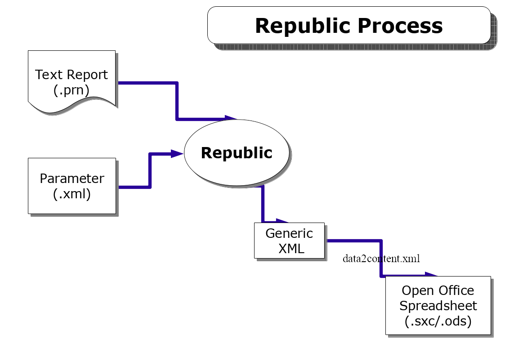

README FIRST

CHANGES
=======
v0.2 (minor changes - split of main parser to diff objects)
v0.3 (multiRow parsing to one spreadsheet row)
v0.4 (more parsing options - see runExample3.sh)
v0.5 - More parsing improvements,
     - Ability to parse the same report into multiple sheets
     within an OO worksheet.
     - Shellscript provided by DeBortoli Wines to take a report file
     and match it to a parsing parameter file, parse then store the
     result. Thank you Gleny Baca and Bill Robertson.
v0.6 - Configured for OO Documents v2.0

If you've found this application to be worthwhile, why not sponsor some of the
development effort... http://www.sf.net/projects/republic

TESTING ENVIRONMENTS
====================
Release 0.6 has been tested on HP-UX and Linux.
There is a good chance it works on Windows too.

MAJOR SPONSOR
=============
This project was sponsored by De Bortoli Wines of Australia.
http://www.debortoli.com.au, who open sourced it hoping others may find the
project interesting and useful.

De Bortoli use Republic with MFG-PRO to take reports directly to spreadsheet.

Introduction
============
This project's aim is to provide an OSS ascii report parser that takes data from
legacy application report files (those old ones that go to the line printer) andextracts the useful bits into a nice OASIS Open Office oocalc document for
your accountants to get excited about.

Please use and abuse this software it is yours for the keeping. Don't forget to
hand back bug fixes and improvements. That way we all win.

The Examples:

shellscripts/runExample1.sh
shellscripts/runExample2.sh
shellscripts/runExample3.sh
shellscripts/runRepublic.sh

There are also some .bat scripts but they are a bit out of date. I've altered the parameters for the new release but not tested them.

To get an idea about how this software works, if your are running linux, execute these shell scripts. Republic is VERY scriptable, it's written for organisations to automate from the command line after a computer report finishes. What should happen by the end of the shell script is open office calc should start up and load a database of the data from the ASCII report in TestData/TestReport001.rpt. Of course, on your site, you might want to auto-email the resultant spreadsheet to the distribution list or something.

An example of scripting from De Bortoli is provided: reportFileIntoRepublic.sh which takes an input report file from their ERP system (MFG-PRO), looks for a valid match on parse file name = report file name, if not found, runs a default parse xml what loads to OO in a single column load otherwise does the customised parse and loads for that specific report layout.

~~There is also a docs directory which:~~
- ~~Shows the overall process flow of republic from a print file to an OO spreadsheet.~~
- ~~Provides documentation on the various parsing options and how to use them.~~

~~This should be enough for you to work out how to do it you your own reports.~~

Documention now combined into this markdown file - Ben L, 20181203

Happy parsing.

Stuart Guthrie
stuart@polonious.com.au
Polonious
Sydney Australia
To thine ownself be true.

-----------------------------

# Republic Parse Options

## Parsing XML Parameters

How republic parses your reports is determined by the parseParameters.xml file. These are the fields of note in that file:

| Level | Field                 | Notes                                                                                                                                                                                         |
| ----- | --------------------- | --------------------------------------------------------------------------------------------------------------------------------------------------------------------------------------------- |
| 1     | `<parse-parameters>`  | Denotes the start and end of a parse file.                                                                                                                                                    |
| 2     | `<report-name>`       | Notation only. Used to id the normal input report.                                                                                                                                            |
| 2     | `<report-type>`       | Notation Only.                                                                                                                                                                                |
| 2     | `<parseSheets>`       | Denotes the start/end of the set of parse runs we will be making. For example, you might parse the same report several times in order to create several output sheets on the one spreadsheet. |
| 3     | `<sheetName>`         | Denotes the name given to the output spreadsheet.                                                                                                                                             |
| 3     | `<parseRules>`        | Denotes the start/end of the set of parseRules for this output sheet name.                                                                                                                    |
| 4     | `<parseRule>`         | Denotes the start/end of a specific parseRule.                                                                                                                                                |
| 5     | `<parse-type>`        | A parsing instruction to the parser. These are explained in Parsing Types                                                                                                                     |
| 5     | `<start-col>`         | Denotes the starting column for a parse type.                                                                                                                                                 |
| 5     | `<end-col>`           | Denotes the ending column for a parse type.                                                                                                                                                   |
| 5     | `<start-row>`         | Denotes the starting row for a parse type.                                                                                                                                                    |
| 5     | `<end-row>`           | Denotes the ending column for a parse type.                                                                                                                                                   |
| 5     | `<output-field-name>` | Denotes the name to give a column of parsed data.                                                                                                                                             |
| 5     | `<output-field-type>` | Denotes the field type to give a column of parsed data. Options are: currency, date, percentage, number, string.                                                                              |
| 5     | `<match-string>`      | Denotes for some parse-types the string that must be matched. Special Values are: Blank, NotBlank, Any other values are treated as exact matches.                                             |

## Parsing Strategies

There are currently three main parsing strategies you may utilise to extract data from a report into a spreadsheet via Republic.

1. SingleRow. NewRowIf.
2. MultiRow. NewMultiRowIf.
3. AllData. AllDataIf.

Which ever strategy you pick is really the only one you can easily use for that output sheet. Using multiple strategies will really confuse the parser!

## Parsing Types

These are instructions that can be given to the parser to help you get the data into the right columns and to strip useless rows of data.

| Parse Type              | Comments                                                                                                                                                                                                                                                                            |
| ----------------------- | ----------------------------------------------------------------------------------------------------------------------------------------------------------------------------------------------------------------------------------------------------------------------------------- |
| IgnorePageRows          | On a new page, ignore the top of page down from `<start-row>` to `<end-row>`.                                                                                                                                                                                                       |
| IgnoreNewPageUntil      | On a new page, ignore the top of page down until `<match-string>`.                                                                                                                                                                                                                  |
| NewRowIf                | If <start-col> to <end-col> match the string in the <match-string> element. Start a new spreadsheet row.                                                                                                                                                                            |
| SelectFieldData         | Select all data from `<start-col>` to `<end-col>` into the next avail column. Call that column the `<output-field-name>` and make it type `<output-field-type>`.                                                                                                                    |
| NewMultiRowIf           | If `<start-col>` to `<end-col>` match the string in the `<match-string>` element. Start a new buffer of the next `<start-row>` to `<end-row>` then allow the user to select any field values in that buffer based on start/end column and a particular row. See SelectMultiRowData. |
| SelectMultiRowFieldData | Select all data from `<start-row>`  and `<start-col>` to `<end-col>` into the next avail column. Call that column the `<output-field-name>` and make it type `<output-field-type>`.                                                                                                 |
| AllDataIf               | If `<start-col>` to `<end-col>` match the string in the `<match-string>` element.  Go into AllDataMode and from here on, object SelectAllData instructions and parse the data into column1.                                                                                         |
| SelectAllData           | Select all data from `<start-col>` to `<end-col>` into col 1 of the output sheet. This is useful for dumping the whole report to col1 of the spreadsheet and manually parsing or using it for a reference.                                                                          |
| NewSavedRowIf           | If matched, it saves the most recent row for reference via the `<SelectSavedRowFieldData>` type.                                                                                                                                                                                    |
| SelectSavedRowFieldData | Selects all data between `<start-col>` and `<end-col>` from the last matched `NewSavedRowIf`.                                                                                                                                                                                       |
